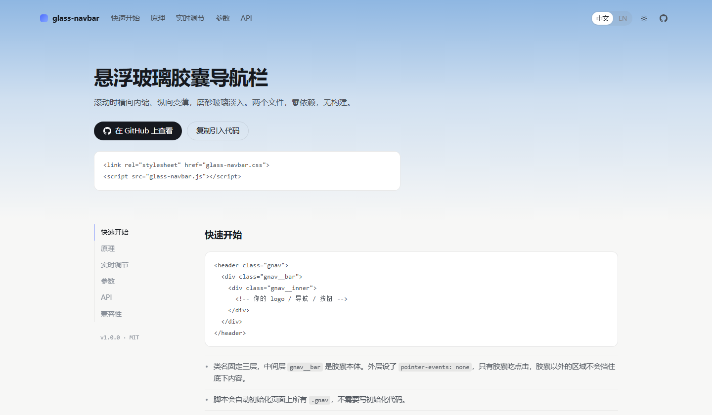
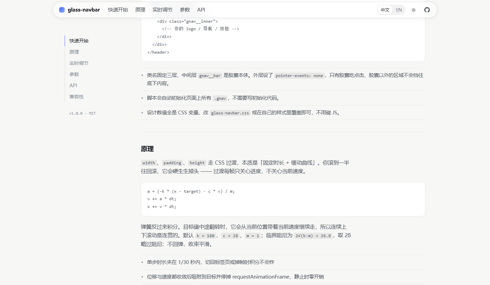
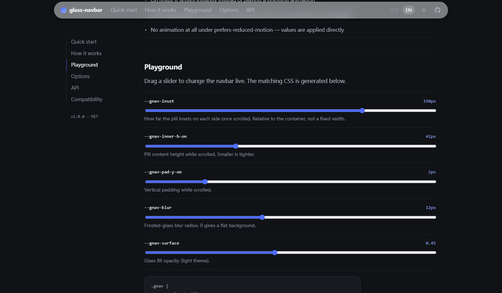

# 悬浮玻璃胶囊导航栏 · glass-navbar

> 滚动时**横向内缩 + 纵向变薄**，磨砂玻璃淡入浮起来的顶栏效果。
> 两个文件，零依赖，无构建步骤。

<p>
  
  
  
  
</p>

**在线演示 → https://ningqi24.github.io/deepseek-style-floating-navbar/**
（打开后向下滚一下，就有实时调节面板可以拖着玩）





---

## ⚠️ 关于名称

仓库名里的 `deepseek-style` **只表示设计参照来源**，方便同样在找这个效果的人搜到。

- 本项目是**独立实现**，**与 DeepSeek 无任何关联，也未获其授权或认可**
- **不包含** DeepSeek 的任何源代码、CSS、图片素材或商标
- 弹簧、几何、交互全部是照着"效果"自己写的，不是从对方站点的代码里扒的

如果你要拿去做商业项目，请自行评估并替换掉任何可能引起混淆的表述。

---

## 它到底做了什么

| | 未滚动 | 滚过阈值后 |
| --- | --- | --- |
| 宽度 | 占满容器（默认 1280px） | **左右各内缩 80px** |
| 高度 | 58px | **48px**（内边距与内容高度各收一档） |
| 背景 | 完全透明 | **磨砂玻璃** `blur(12px) saturate(170%)` |
| 描边 | 无 | `rgba(0,0,0,.1)` |

关键在于**收窄的过程是弹簧驱动的**，不是 CSS transition —— 这就是它看起来"液态"而不是"机械"的原因，详见下一节。

---

## 快速开始

### 1. 放结构

类名固定三层，中间层 `.gnav__bar` 是胶囊本体：

```html
<header class="gnav">
  <div class="gnav__bar">
    <div class="gnav__inner">
      <!-- 你的 logo / 导航 / 按钮 -->
    </div>
  </div>
</header>
```

### 2. 引文件

```html
<link rel="stylesheet" href="glass-navbar.css">
<script src="glass-navbar.js"></script>
```

脚本会自动初始化页面上所有 `.gnav`，不需要写初始化代码。

### 3. 改数值

所有设计数值都是 CSS 变量，**改 CSS 就行，不用碰 JS**：

```css
.gnav {
  --gnav-inset: 60px;         /* 想要更"浮"就调大，想更收敛就调小 */
  --gnav-inner-h-on: 40px;    /* 滚动后想更薄就调小 */
  --gnav-pad-y-on: 2px;
  --gnav-blur: 16px;
  --gnav-surface: hsla(0, 0%, 100%, .5);
}
```

演示页上有**实时调节面板**，拖滑块就能看到效果并直接拷走对应的 CSS。
演示页支持中英双语与明暗主题（跟随系统，也可手动切），都可以在页头直接切。

组件本体不含任何文案，多语言只影响演示页。

---

## 为什么用弹簧，而不是 CSS transition

`width`、`padding`、`height` 走 CSS 过渡，本质是「固定时长 + 缓动曲线」。看着还行，但有个要命的毛病：

**你滚到一半往回滚，它会硬生生掉头。** 因为 CSS 过渡每帧只关心"从起点到终点的进度"，不关心当前速度。

弹簧是反过来积分的：

```js
a = (-k * (x - target) - c * v) / m;   // 加速度 = 弹力 + 阻尼
v += a * dt;                            // 速度
x += v * dt;                            // 位移
```

目标值中途翻转时，它会**从当前位置带着当前速度继续走**。所以连续上下滚动时，胶囊的收放是连贯的、有惯性的 —— 这就是"液态"的来源。

默认参数 `k = 180`、`c = 28`、`m = 1`。临界阻尼是 `2√(k·m) = 2√180 ≈ 26.8`，取 28 刚好比临界阻尼大一点点：

- 不会来回振荡（那种"弹簧感"其实很廉价）
- 但收束曲线是平滑的，不是线性刹车

想调手感就改 `data-gnav-stiffness` / `data-gnav-damping`。

### 顺手处理的工程细节

- **单步时长夹在 1/30 秒内** —— 切回标签页或严重掉帧时，积分不会炸掉
- **位移与速度都收敛就吸附到目标并停掉 `requestAnimationFrame`** —— 静止时零开销，不空转
- **窗口缩放时直接落值** —— 不会看到一段毫无意义的收放动画
- **滚动时不读 `getComputedStyle`** —— 令牌只在初始化和缩放时读一次并缓存，避免在 scroll 回调里反复计算样式
- **`prefers-reduced-motion` 下完全不做动画**，直接落值

---

## 参数表

### CSS 变量（在 `.gnav` 上覆盖）

| 变量 | 默认值 | 说明 |
| --- | --- | --- |
| `--gnav-inset` | `80px` | 滚动后左右各内缩多少。**相对容器计算**，不是绝对宽度 |
| `--gnav-inset-min` | `720` | 容器窄于此值（无单位数字）就自动不内缩，避免手机上内容被挤爆 |
| `--gnav-top` / `--gnav-top-on` | `8px` / `5px` | 容器顶部留白（未滚动 / 滚动后） |
| `--gnav-pad-y` / `--gnav-pad-y-on` | `4px` / `2px` | 胶囊纵向内边距 |
| `--gnav-inner-h` / `--gnav-inner-h-on` | `48px` / `42px` | 胶囊内容高度 |
| `--gnav-pad-l-on` / `--gnav-pad-r-on` | `18px` / `12px` | 滚动后内容左右内缩，避免贴到圆角上 |
| `--gnav-max-width` | `1280px` | 容器最大宽度 |
| `--gnav-side-gap` | `32px` | 容器距视口左右边缘的留白 |
| `--gnav-radius` | `100px` | 胶囊圆角 |
| `--gnav-blur` | `12px` | 磨砂玻璃模糊半径，`0` 即纯色背景 |
| `--gnav-saturate` | `170%` | 磨砂玻璃饱和度增强 |
| `--gnav-surface` | `hsla(0,0%,100%,.45)` | 玻璃底色 |
| `--gnav-border` | `rgba(0,0,0,.1)` | 玻璃描边 |
| `--gnav-shadow` | `0 2px 12px rgba(21,36,67,.07)` | 胶囊投影 |
| `--gnav-glass-duration` | `.3s` | 玻璃淡入时长（外观走 CSS 过渡，尺寸走弹簧） |

### 物理参数（data 属性或 JS 选项）

| 属性 / 选项 | 默认值 | 说明 |
| --- | --- | --- |
| `data-gnav-threshold` / `threshold` | `80` | 触发收窄的滚动距离（px） |
| `data-gnav-stiffness` / `stiffness` | `180` | 劲度系数 k，越大越快 |
| `data-gnav-damping` / `damping` | `28` | 阻尼系数 c，越小越容易回弹 |
| `data-gnav-mass` / `mass` | `1` | 质量 m |

```html
<header class="gnav" data-gnav-threshold="120" data-gnav-stiffness="220" data-gnav-damping="30">
```

---

## JS API

```js
// 自动初始化页面上所有 .gnav（引了脚本就自动跑，一般不用手写）
GlassNavbar.initAll();

// 手动实例化
const nav = new GlassNavbar('#gnav', { threshold: 120, stiffness: 220, damping: 30 });

nav.update();    // 重新计算目标值并开始动画
nav.settle();    // 不做动画，直接落到当前状态
nav.destroy();   // 移除实例、清掉内联样式与监听器

GlassNavbar.instances;  // 所有存活实例
```

---

## 深色模式

跟随系统 `prefers-color-scheme` 自动切换玻璃配色。也可以手动指定：

```html
<html data-theme="dark">   <!-- 或 -->
<header class="gnav gnav--dark">
```

同时提供 `--gnav-surface` / `--gnav-border` / `--gnav-shadow` 三个变量让你完全自定义。

---

## 兼容性与无障碍

- Chrome / Edge 88+、Safari 15.4+、Firefox 103+
- **`backdrop-filter` 不支持时自动退化为纯色背景**（`@supports` 兜底），功能不受影响
- 开启系统「减弱动态效果」后，尺寸变化不再有动画，直接落值
- 容器设了 `pointer-events: none`、只有胶囊本体是 `auto` —— 所以胶囊**以外**的区域不会挡住底下内容的点击（这层固定定位最容易踩的坑）
- 只用 CSS 变量与内联样式，不污染宿主页面的其它样式

---

## 本地预览与自检

```bash
npm run serve     # http://127.0.0.1:4174/
npm run check     # 校验中英词条对齐、页面引用的 key 存在、本地资源存在、JS 语法
```

组件本身不依赖 Node，这两个脚本只服务于演示页。

---

## 文件

```
glass-navbar.css     组件样式（唯一需要引入的 CSS）
glass-navbar.js      组件逻辑（唯一需要引入的 JS）
index.html           演示 / 文档页
demo.css             演示页样式
demo.js              演示页交互（语言、明暗、菜单、实时调节、复制）
demo-i18n.js         演示页的中英文案
check.mjs            自检脚本
serve.mjs            本地预览服务器
```

除前两个文件外，其余都只服务于演示页，删掉不影响组件。

---

## English

A zero-dependency floating **glass pill navbar / header** that **shrinks horizontally and thins
vertically on scroll**, with a frosted-glass background fading in — the pattern seen on
DeepSeek's homepage. The size transition is driven by an **integrated spring**
(`stiffness 180 / damping 28 / mass 1`, i.e. just past critical damping) rather than a CSS
transition, so scrolling back and forth mid-animation feels continuous instead of snapping.

Pure HTML + CSS + vanilla JavaScript. No framework, no build step, no dependencies.
Everything is configurable through CSS custom properties (`--gnav-*`).

Not affiliated with DeepSeek; contains none of their code, assets or trademarks.

---

## License

MIT —— 见 [LICENSE](LICENSE)。
